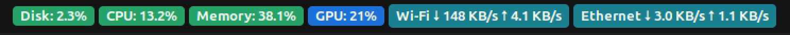

# PSI Monitor

A GNOME Shell extension that puts **disk, CPU, memory, GPU and network speed** in
the top bar as colored badges. The number says _how much_ is in use. The color says
whether the system is actually _struggling_ because of it, using the Linux
kernel's Pressure Stall Information (PSI).



## Quick start

```bash
git clone https://github.com/pablomelo-inf/psi-monitor.git
cd psi-monitor
make install
```

Restart GNOME Shell so it discovers the extension (**X11:** `Alt+F2`, type `r`,
`Enter`. **Wayland:** log out and back in), then:

```bash
make enable
```

The badges appear on the right side of the top bar. Details in
[Installation](#installation).

## Contents

- [Why PSI?](#why-psi)
- [Features](#features)
- [Reading the badges](#reading-the-badges)
- [Requirements](#requirements)
- [Compatibility](#compatibility)
- [Installation](#installation)
- [Configuration](#configuration)
- [Usage](#usage)
- [Privacy and permissions](#privacy-and-permissions)
- [Performance](#performance)
- [Development](#development)
- [Troubleshooting](#troubleshooting)
- [Limitations](#limitations)
- [License](#license)

## Why PSI?

Usage alone is a poor "is my machine slow?" signal. A CPU at 100% can be
perfectly healthy, while a disk at 20% can make everything feel frozen.
PSI (`/proc/pressure/*`) reports the share of time tasks spent **stalled
waiting** for a resource, which is much closer to what you actually feel.

This extension shows both: usage as the number, PSI as the color.

## Features

- Badges for disk, CPU, memory, GPU (NVIDIA), and Wi-Fi and Ethernet speed.
- Badge color from kernel pressure: green, yellow or red.
- Each badge has its own menu, opened by clicking it, with the details the badge cannot fit:
  - PSI `some` / `full` over 10 s, 60 s and 5 min windows;
  - a "now (2s)" value with 3 decimals, computed from the kernel's
    cumulative counter (finer than the 2 decimals in `avg10`);
  - **per-disk** busy %, read/write MB/s and mount points;
  - CPU core count and real usage;
  - RAM and swap in use;
  - GPU usage, VRAM and temperature;
  - Wi-Fi and Ethernet: link state, link speed, Wi-Fi signal, download and upload speed per
    interface.
- Few moving parts: a handful of tiny `/proc` reads every 2 s, plus one
  long-running `nvidia-smi` process read asynchronously.
- **Choose which badges to show**: tick them in the "Show in top bar" list at the end of any badge menu,
  or right-click a badge to open just that list. Your choice is remembered. Hiding the GPU badge
  also stops the `nvidia-smi` process.
- Everything created in `enable()` is released in `disable()`.

## Reading the badges

The **number** is usage. The **color** is pressure: `some avg10`, the share of
the last 10 s in which at least one task was stalled.

| Badge    | Number                     | Color comes from                |
| -------- | -------------------------- | ------------------------------- |
| Disk     | busy % of the busiest disk | `/proc/pressure/io` (all disks) |
| CPU      | usage % across all cores   | `/proc/pressure/cpu`            |
| Memory   | RAM in use %               | `/proc/pressure/memory`         |
| GPU      | GPU usage % (`nvidia-smi`) | fixed blue (usage only)         |
| Wi-Fi    | download and upload speed  | teal when connected, gray `off` |
| Ethernet | download and upload speed  | teal when connected, gray `off` |

| Color  | Time stalled (`avg10`) | Meaning                          |
| ------ | ---------------------- | -------------------------------- |
| green  | below 5%               | healthy                          |
| yellow | 5% to 20%              | noticeable stalls                |
| red    | 20% or more            | the system is visibly struggling |

Examples:

- `CPU: 90%` in **green**: busy but healthy, nobody is waiting for a core.
- `Disk: 8%` in **red**: little disk traffic, yet tasks are stalling on I/O.

Notes:

- PSI is system-wide. It cannot say _which_ disk or core is responsible, so
  the menu breaks usage down per disk.
- The GPU has no PSI, so its badge shows usage only and is always blue.
- Network has no PSI either. The Wi-Fi and Ethernet badges show speed (bytes per second,
  decimal units) and appear only when such an interface exists. Only physical interfaces count:
  Docker bridges, veth pairs and VPNs are ignored, so traffic is not counted twice. An interface
  counts as connected when its link is up **and** it has an IPv4 route. Turning it off from the
  desktop's network menu with the cable still plugged in leaves the physical link up, so the link
  state alone would still look active.
- At idle, all three colored badges stay green. That is the normal state.

## Requirements

| Needed for                                | Requirement                                                                                              |
| ----------------------------------------- | -------------------------------------------------------------------------------------------------------- |
| Running                                   | GNOME Shell **46** (Ubuntu 24.04) and a Linux kernel with PSI (`/proc/pressure/` exists)                 |
| Installing from source                    | `git` and `make`                                                                                         |
| GPU badge (optional)                      | NVIDIA driver providing `nvidia-smi`. Without it the badge shows `GPU: n/a`                              |
| `make check` / `make test`                | Node.js (tested with 22 and 23.10) and Python 3 (JSON check)                                             |
| `make setup` / `make lint`                | Node.js 22 LTS (pinned in `.nvmrc`) and [pre-commit](https://pre-commit.com) (`pipx install pre-commit`) |
| `make install` / `check` / `pack` / `deb` | `glib-compile-schemas` (package `libglib2.0-bin`)                                                        |
| `make pack`                               | `zip`                                                                                                    |
| `make deb`                                | `dpkg-deb` (Debian, Ubuntu and derivatives)                                                              |

Tested on Ubuntu 24.04.2, GNOME Shell 46.0 (X11), NVIDIA RTX 3060.
Run `make doctor` to check your machine.

## Compatibility

The extension and the `.deb` target **GNOME Shell 46**. What decides
compatibility is your GNOME Shell version, not the distribution name. Check it
with `gnome-shell --version`.

| System                                                    | GNOME Shell                  | Status                                             |
| --------------------------------------------------------- | ---------------------------- | -------------------------------------------------- |
| Ubuntu 24.04 LTS                                          | 46                           | **Supported and tested**                           |
| Ubuntu 22.04 LTS                                          | 42                           | Not supported                                      |
| Any other release (Debian, Fedora, Arch, newer Ubuntu...) | check with the command above | Supported only if it reports 46; otherwise not yet |

Other versions will be added after being tested, not guessed.

Also required:

- **GNOME Shell as the desktop.** KDE, XFCE, Cinnamon and similar are not
  supported, whatever the distribution.
- **A kernel with PSI.** Ubuntu 24.04 kernels have it on. If `/proc/pressure/`
  does not exist, your kernel was built without PSI (`CONFIG_PSI`) or booted with
  `psi=0`. On kernels built with `CONFIG_PSI_DEFAULT_DISABLED`, boot with `psi=1`.
- **Architecture:** the package is `all` (plain JavaScript), so it is not tied
  to a CPU. Only amd64 has been tested.
- **Session:** X11 tested. Wayland is expected to work but is untested.

What happens on an unsupported GNOME Shell:

- **`.deb`:** `apt` refuses and changes nothing on your system, with a message
  like this one (version numbers will differ):

  ```
  The following packages have unmet dependencies:
   gnome-shell-extension-psi-monitor : Depends: gnome-shell (>= 47~) but 46.0 is to be installed
  E: Unable to correct problems, you have held broken packages.
  ```

- **Zip or `make install`:** nothing checks at install time, but GNOME marks
  the extension as incompatible and does not load it. `make doctor` warns about
  this up front.

## Installation

### From source (recommended)

```bash
git clone https://github.com/pablomelo-inf/psi-monitor.git
cd psi-monitor
make config       # optional, see Configuration
make install      # copies the extension, links the `psi-monitor` command
```

Restart GNOME Shell:

- **X11:** press `Alt+F2`, type `r`, press `Enter`. Windows stay open.
- **Wayland:** log out and back in.

Then enable it:

```bash
make enable
```

### From a .deb (Ubuntu and Debian)

Download `gnome-shell-extension-psi-monitor_<VERSION>_all.deb` from the
[Releases](https://github.com/pablomelo-inf/psi-monitor/releases) page, then:

```bash
sudo apt install ./gnome-shell-extension-psi-monitor_<VERSION>_all.deb
# restart GNOME Shell as above, then:
gnome-extensions enable psi-monitor@<HANDLE>
```

The package installs the extension for **all users** under
`/usr/share/gnome-shell/extensions/`, and each user enables it for themselves.
Installing does not enable the extension. It needs `sudo`, because it writes to
system folders; the zip and `make install` below do not.

It depends on **GNOME Shell 46** (Ubuntu 24.04). On any other version `apt`
refuses to install it and changes nothing; see [Compatibility](#compatibility).

### From a release zip

Download `psi-monitor@<HANDLE>.shell-extension.zip` from the
[Releases](https://github.com/pablomelo-inf/psi-monitor/releases) page. Use
that file, **not** the automatic "Source code" archives: those lack the
generated `metadata.json` and cannot be installed as an extension. Replace
`<HANDLE>` with the suffix in the file name.

Each release also ships a `SHA256SUMS` file. To verify the download, run
`sha256sum -c SHA256SUMS` in the folder with both files.

You can also build the zip yourself with `make pack`.

```bash
gnome-extensions install --force psi-monitor@<HANDLE>.shell-extension.zip
# restart GNOME Shell as above, then:
gnome-extensions enable psi-monitor@<HANDLE>
```

If `gnome-extensions install` is unavailable or crashes, unzip manually:

```bash
unzip -o psi-monitor@<HANDLE>.shell-extension.zip \
  -d ~/.local/share/gnome-shell/extensions/psi-monitor@<HANDLE>
```

### Check that it works

```bash
make status       # expect "State: ACTIVE"
```

The badges should appear on the right side of the top bar. For a moment they
may show `…` until the second sample arrives (about 2 s). Click a badge to open
its details menu.

### Uninstall

```bash
make uninstall                                  # installed from source
sudo apt remove gnome-shell-extension-psi-monitor  # installed from the .deb
gnome-extensions uninstall psi-monitor@<HANDLE> # installed from a zip
```

## Configuration

Personal values live in `config.mk`, which is **gitignored**. The repository
ships only `config.example.mk`. Configuration is optional: without it the
extension works with the default UUID `psi-monitor@local`.

```bash
make config       # copies config.example.mk to config.mk (never overwrites)
$EDITOR config.mk
```

| Variable         | Purpose                                                                                                                                   |
| ---------------- | ----------------------------------------------------------------------------------------------------------------------------------------- |
| `HANDLE`         | Suffix of the extension UUID: `psi-monitor@<HANDLE>`. Defaults to `local` without a `config.mk`. Use letters, digits and dashes.          |
| `DEB_MAINTAINER` | Optional. `Maintainer` field of the `.deb`, which is public inside the package. Defaults to `<HANDLE> <HANDLE@users.noreply.github.com>`. |

Things to know:

- `config.example.mk` sets `HANDLE := your-github-username`. Replace it,
  otherwise that placeholder becomes your UUID.
- `HANDLE` is the extension's identity. If you change it after installing, run
  `make uninstall` **first** (with the old value), or the old copy stays behind.
- `metadata.json` is generated from `metadata.json.in` using `HANDLE`, so it is
  gitignored too. `make install`, `make check` and `make pack` regenerate it.

## Usage

After `make install`, the `psi-monitor` command runs this project's make
targets **from any directory**:

```bash
psi-monitor            # list the targets
psi-monitor status     # state reported by GNOME
psi-monitor enable
psi-monitor disable
psi-monitor logs       # follow GNOME Shell logs
```

The command is a symlink in `~/.local/bin`. If your shell does not find it,
that directory is not in `PATH`. Ubuntu adds it at login when it exists, so log
out and back in, or run `export PATH="$HOME/.local/bin:$PATH"`.

## Privacy and permissions

The extension runs inside GNOME Shell with your user's permissions. What it
does:

- **Reads** `/proc/pressure/{io,cpu,memory}`, `/proc/stat`, `/proc/meminfo`,
  `/proc/diskstats`, `/proc/mounts`, `/proc/net/route`, `/proc/net/wireless` and, per disk,
  `/sys/block/<disk>/size` and `/sys/block/<disk>/device/model`. For each
  physical network interface it reads `/sys/class/net/<name>/operstate`,
  `speed` and `statistics/{rx,tx}_bytes`.
- **Runs** `nvidia-smi` with a read-only query (utilization, memory,
  temperature). Nothing is run if it is not installed.
- **Stores one setting**, the list of hidden badges, in GSettings (dconf), the standard place for
  extension settings.
- **Does not** send, capture or inspect network traffic (it only reads the byte counters the kernel
  already keeps), open connections, write files, or need root.

## Performance

The extension is written in JavaScript, which GNOME Shell runs through GJS (the
SpiderMonkey engine, with a JIT compiler). The work is tiny: a few small reads
of `/proc` every 2 seconds and some arithmetic. The cost is in the system
calls, not in the language, so the language is not a factor here.

Measured on one machine (Ubuntu 24.04, GNOME Shell 46 on X11, 16 cores, two
SSDs, one NVIDIA GPU):

| What                                                          | Result                                |
| ------------------------------------------------------------- | ------------------------------------- |
| One full sample (PSI, CPU, memory, disk and network counters) | about 0.8 ms                          |
| That sample, taken every 2 s                                  | about 0.04% of one core               |
| The long-running `nvidia-smi` process, over a 20 s window     | about 0.05% of one core, about 21 MiB |
| For scale: the whole `gnome-shell` process, same 20 s window  | about 3.7% of one core                |

How it was measured: the sampler was called 5000 times under `gjs`, with the
`gjs` start-up time subtracted. Process CPU came from `/proc/<pid>/stat` over 20
seconds. Your numbers will differ with the number of disks and the CPU.

Why it stays cheap:

- **The shell never waits on a slow call.** GNOME Shell draws the whole desktop
  from one thread, so a slow call there freezes everything. The only
  synchronous work is reading small files from `/proc` and `/sys` (served from
  memory, well under 1 ms in total).
  `nvidia-smi`, which can take tens of milliseconds, is a separate process read
  asynchronously.
- **Nothing is left behind.** Every timer and widget created in `enable()` is
  released in `disable()`.

Not measured: the cost of redrawing the badges, and memory growth over many
hours. To check on your machine, compare `gnome-shell` CPU with the extension
enabled and disabled, and watch its memory over a long session.

## Development

### Layout

```
psi-monitor/
├── extension.js         GNOME Shell glue: badges, menu, timer, enable/disable
├── metadata.json.in     metadata template; make generates metadata.json from it
├── stylesheet.css       badge colors
├── lib/
│   ├── psi.js           PSI parser, severity levels, instant % from counters
│   ├── system.js        parsers: meminfo, cpu stat, diskstats, mounts
│   ├── gpu.js           nvidia-smi line parser
│   ├── badges.js        which badges are shown (pure logic, unit-tested)
│   └── sampler.js       reads /proc and turns samples into rates (GLib only)
├── test/                unit tests (Node)
├── bin/psi-monitor      wrapper: runs this project's make targets from anywhere
├── docs/screenshot.png  image used in this README
├── schemas/             GSettings schema that stores which badges are hidden
├── packaging/deb/       templates for the .deb control and copyright files
├── scripts/release-notes.sh  extracts one version's notes from CHANGELOG.md
├── .github/workflows/ci.yml  CI (tests, lint, Trivy scan) and automatic releases
├── .github/dependabot.yml    weekly updates for pinned actions and npm tools
├── CHANGELOG.md         release notes, one section per version
├── config.example.mk    template for your personal, gitignored config.mk
├── Makefile             entry point for every task
├── package.json         dev-only: ES modules marker, Prettier and ESLint
├── package-lock.json    locked dev dependency versions
├── .pre-commit-config.yaml  every lint hook, used locally and in CI
├── .prettierrc.json     formatting rules
├── eslint.config.js     lint rules
├── .nvmrc               Node version for the dev tools (22)
├── LICENSE
├── .editorconfig
└── .gitignore
```

Generated or local files, not in git: `config.mk`, `metadata.json`, `dist/`.

`lib/psi.js`, `lib/system.js` and `lib/gpu.js` import nothing from GNOME, so
they are unit-tested with plain Node. `extension.js` and `lib/sampler.js` need
GNOME's runtime (GJS) and are exercised by running them in the shell.

### Make targets

Run `make` with no arguments for the live list.

| Target      | What it does                                                     |
| ----------- | ---------------------------------------------------------------- |
| `help`      | list the targets (default)                                       |
| `config`    | create `config.mk` from `config.example.mk` if missing           |
| `setup`     | install the dev tools (`npm ci`) and the git pre-commit hook     |
| `hooks`     | install the git pre-commit hook                                  |
| `lint`      | run every linter and format check on all files (same as CI)      |
| `format`    | format JS, JSON, CSS, YAML and Markdown with Prettier            |
| `install`   | copy the extension to GNOME and link the `psi-monitor` command   |
| `uninstall` | disable and remove the extension and the command link            |
| `link`      | symlink the `psi-monitor` command into `~/.local/bin`            |
| `unlink`    | remove that symlink                                              |
| `enable`    | enable the extension                                             |
| `disable`   | disable the extension (no error if missing)                      |
| `status`    | show the state GNOME reports for the extension                   |
| `reload`    | print how to restart GNOME Shell on X11 (it does not do it)      |
| `logs`      | follow GNOME Shell logs                                          |
| `version`   | print the extension version (from `metadata.json.in`)            |
| `doctor`    | check shell version, session, Node, PSI and config               |
| `check`     | validate `metadata.json` and the JS syntax                       |
| `test`      | run the unit tests                                               |
| `pack`      | build `dist/psi-monitor@<HANDLE>.shell-extension.zip`            |
| `deb`       | build `dist/gnome-shell-extension-psi-monitor_<VERSION>_all.deb` |
| `clean`     | remove `dist/`                                                   |

### Workflow

```bash
make test && make install     # after editing extension.js or lib/
# X11: Alt+F2, r, Enter to reload the shell (Wayland: log out and back in)
make logs                     # in another terminal, if something looks wrong
```

`make test` ends with a summary; success is `fail 0`.

### Code quality and security

One-time setup (Node 22 LTS, then the tools):

```bash
nvm use             # reads .nvmrc; or install Node 22 any other way
pipx install pre-commit
make setup          # npm ci + installs the git pre-commit hook
```

A single file, `.pre-commit-config.yaml`, drives everything. It runs on every
commit for the staged files, with `make lint` for all files, and in CI.

| Tool                                                               | What it checks                                                                                                           |
| ------------------------------------------------------------------ | ------------------------------------------------------------------------------------------------------------------------ |
| [Prettier](https://prettier.io)                                    | formatting of JS, JSON, CSS, YAML and Markdown (`.prettierrc.json`); fixes files itself                                  |
| [ESLint](https://eslint.org)                                       | JavaScript problems and style rules (`eslint.config.js`)                                                                 |
| [ShellCheck](https://www.shellcheck.net)                           | the shell scripts in `bin/` and `scripts/`                                                                               |
| [actionlint](https://github.com/rhysd/actionlint)                  | GitHub Actions workflows                                                                                                 |
| [pre-commit-hooks](https://github.com/pre-commit/pre-commit-hooks) | trailing whitespace, final newline, valid YAML/JSON, merge markers, large files, committed private keys, executable bits |

If Prettier changes a file, the commit stops: review `git diff`, `git add` the
result and commit again. `git commit --no-verify` skips the hook in an
emergency, but CI runs the same checks and will still fail.

**Security scan.** CI also runs [Trivy](https://trivy.dev) on the repository. It
looks for known vulnerabilities in `package-lock.json` (dev dependencies
included), secrets committed by mistake and misconfigurations, and fails on
`HIGH` or `CRITICAL` findings that have a fix. It runs on every push and pull
request and **weekly**, because new vulnerabilities appear without new commits.
The extension itself has no third-party runtime dependencies: this protects the
dev toolchain that runs in CI and on your machine. A failing scan blocks the
release.

Actions in the workflow are pinned to full commit SHAs, and Dependabot proposes
updates weekly.

### Releases

Pushing to `main` runs `.github/workflows/ci.yml`. It always runs the unit
tests, the linters and a Trivy security scan, and it publishes a GitHub release
**only when all three pass and the version has no release yet**. A push that does
not bump the version just runs the checks.

To cut a release:

1. Bump `version-name` in `metadata.json.in` (semantic versioning).
2. In `CHANGELOG.md`, move the notes from `## [Unreleased]` into a new
   `## [X.Y.Z] - YYYY-MM-DD` section.
3. Commit and push to `main`.

The workflow then tags `vX.Y.Z`, builds `psi-monitor@<owner>.shell-extension.zip`
and `gnome-shell-extension-psi-monitor_X.Y.Z_all.deb` plus a `SHA256SUMS` file
(`<owner>` is the repository owner, used as the UUID suffix), and publishes the
release with that version's `CHANGELOG.md` section as its notes. If the section is missing
or empty the job fails instead of publishing a release without notes.

To preview the notes locally: `scripts/release-notes.sh X.Y.Z`.

### Contributing

Issues and pull requests are welcome. Run `make setup` once so the git hook
checks every commit, and before opening a pull request run
`make lint && make check && make test`. Keep parsing logic in the GNOME-free
modules under `lib/` and add a test for it.

## Troubleshooting

| Symptom                                                                                   | Likely cause and fix                                                                                                                                                                                                       |
| ----------------------------------------------------------------------------------------- | -------------------------------------------------------------------------------------------------------------------------------------------------------------------------------------------------------------------------- |
| `make enable` says the extension "does not exist"                                         | GNOME has not discovered it yet. Restart the shell (X11: `Alt+F2`, `r`, `Enter`), then enable again.                                                                                                                       |
| Badges missing after enabling                                                             | `make status` should show `ACTIVE`. If it shows `ERROR`, run `make logs` and look for `psi-monitor` or `JS ERROR`.                                                                                                         |
| Badges show `…`                                                                           | Normal for about 2 s: rates need two samples.                                                                                                                                                                              |
| `GPU: n/a`                                                                                | `nvidia-smi` is missing or not in `PATH`, or the GPU is not NVIDIA.                                                                                                                                                        |
| Usage looks wrong                                                                         | Compare with `top` and `nvidia-smi`. If they disagree, open an issue with the `make doctor` output.                                                                                                                        |
| Colored badges are always green                                                           | Normal: PSI is 0 when nothing is stalling. See below to force some load.                                                                                                                                                   |
| `pre-commit: command not found`, or the hook says `npx` cannot find `prettier` / `eslint` | Install pre-commit with `pipx install pre-commit`, and the tools with `make setup` (it runs `npm ci`). Use Node 22 (`nvm use`).                                                                                            |
| A badge disappeared and you want it back                                                  | Right-click any badge and tick it again. To reset them all: `gsettings reset org.gnome.shell.extensions.psi-monitor hidden-badges` (add `--schemadir <extension folder>/schemas` if `gsettings` does not find the schema). |
| `psi-monitor: command not found`                                                          | `~/.local/bin` is not in `PATH`. See [Usage](#usage).                                                                                                                                                                      |
| `gnome-extensions pack` crashes                                                           | It segfaults on some systems. Use `make pack`, which uses plain `zip`.                                                                                                                                                     |

To see PSI move, create load on purpose. For CPU:

```bash
for i in $(seq $(( $(nproc) * 2 ))); do timeout 20 sh -c 'while :; do :; done' & done; wait
```

CPU pressure only rises when there are **more runnable tasks than cores**,
which is why the command starts twice as many busy loops as you have cores.
Each loop ends on its own after 20 s.

## Limitations

- Supports GNOME Shell **46** only (see [Compatibility](#compatibility)). Other versions are untested.
- Tested on **X11 only**. Wayland is expected to work but has not been tested.
- GPU support is NVIDIA-only (through `nvidia-smi`).
- The interface text is English only. There is no translation support.
- PSI cannot attribute pressure to a specific disk or core.
- Network badges show speed only: no Wi-Fi network name (that needs `nmcli`), and only physical
  interfaces are counted.
- An interface only counts as connected if it has an IPv4 route, so a network that is IPv6-only
  shows as `off`.
- Needs a kernel with PSI enabled (`CONFIG_PSI`, and not turned off with
  `psi=0`).

## License

Copyright (C) the PSI Monitor authors.

This program is free software: you can redistribute it and/or modify it under
the terms of the GNU General Public License as published by the Free Software
Foundation, either version 3 of the License, or (at your option) any later
version. See the [LICENSE](LICENSE) file for the full text.
